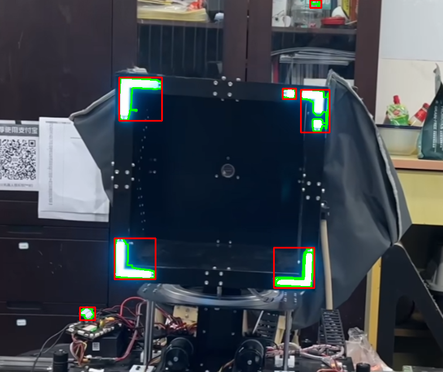
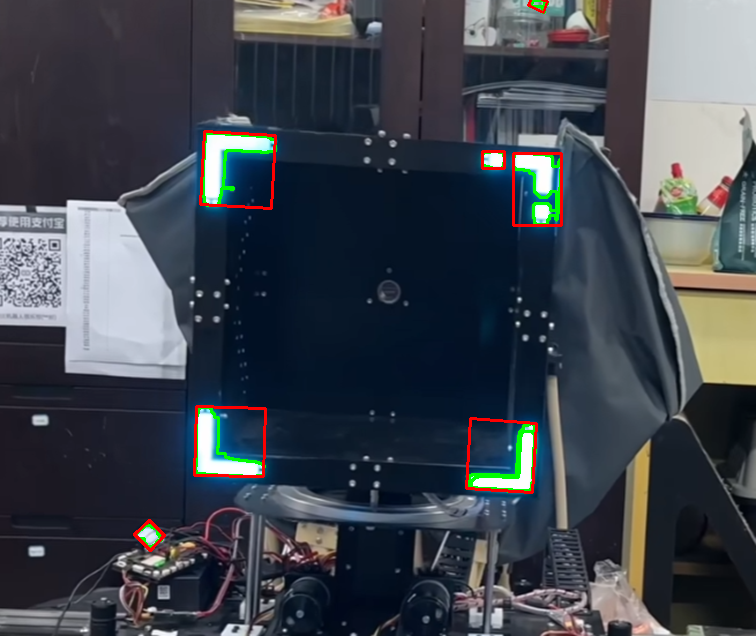
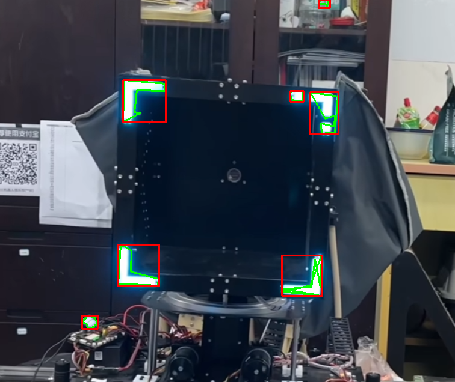

# Blue Arrow Light Strip Detection Module (Single-Frame Detection)

## Module Function Description

This module is designed for **automatic detection and bounding** of **blue arrow light strips in a single image**.
It serves as a **basic detection component** in the overall vision system, providing stable target regions for downstream video tracking, state analysis, or system-level logic.

The module focuses on **color segmentation + contour analysis + geometric bounding**, without involving video reading, interactive control, or system scheduling.

---

## Overview of Detection Strategies

The module implements **three different contour bounding strategies** to compare detection accuracy, stability, and applicability.

| Version | Method                                         | Features                                 | Suitable Scenarios                                   |
| ------- | ---------------------------------------------- | ---------------------------------------- | ---------------------------------------------------- |
| v1      | `boundingRect` (horizontal rectangle)          | Fast and simple                          | Targets roughly horizontal; real-time priority       |
| v2      | `approxPolyDP` + `boundingRect`                | Smoother contours, reduces over-bounding | Slightly irregular contours                          |
| v3      | `minAreaRect` (minimum area rotated rectangle) | Fits any angle, most compact bounding    | Targets with significant tilt or complex orientation |

---

## Example Input Image

The following image demonstrates the **same input** for comparing different bounding strategies:


---

## Detection Results Comparison

### v1 — Horizontal Rectangle (Bounding Rect)

Uses raw contours to generate horizontal bounding rectangles. Computationally cheap but may not tightly bound tilted targets.



---

### v2 — Polygon Approximation + Horizontal Rectangle

First applies `approxPolyDP` for geometric simplification, then generates the bounding rectangle.
This reduces the influence of edge noise on the bounding result.

```python
epsilon = 0.01 * cv2.arcLength(cnt, True)
approx = cv2.approxPolyDP(cnt, epsilon, True)
cv2.drawContours(result_img, [approx], -1, (0, 255, 0), 2)
```


By adjusting the approximation accuracy, a smoother contour can be obtained.

---

### v3 — Minimum Area Rotated Rectangle (Min Area Rect)

Generates a minimum-area rotated rectangle from the contour, accurately fitting arrow strips at any angle.
This is the **highest-precision and most versatile** approach in the module.



---

## Single-Frame Detection Workflow

The following steps describe how the module processes a **single image** internally:

1. **Read image and convert color space**

```python
img = cv2.imread(img_path)
hsv = cv2.cvtColor(img, cv2.COLOR_BGR2HSV)
```

2. **Segment blue regions**

```python
lower_blue = np.array([90, 30, 180], dtype=np.uint8)
upper_blue = np.array([140, 255, 255], dtype=np.uint8)
mask = cv2.inRange(hsv, lower_blue, upper_blue)
```

3. **Morphological closing to reduce noise**

```python
kernel = cv2.getStructuringElement(cv2.MORPH_RECT, (3, 3))
mask = cv2.morphologyEx(mask, cv2.MORPH_CLOSE, kernel, iterations=2)
```

4. **Contour detection**

```python
contours, _ = cv2.findContours(
    mask, cv2.RETR_EXTERNAL, cv2.CHAIN_APPROX_SIMPLE
)
```

5. **Target filtering and bounding**

* Filter out small noise contours
* Generate bounding boxes according to the strategy version
* Draw results and save

---

## Core Code Examples for Each Strategy

### v1 — Raw Contour + Horizontal Rectangle

```python
x, y, w, h = cv2.boundingRect(cnt)
cv2.rectangle(result_img, (x, y), (x + w, y + h), (0, 0, 255), 2)
```

---

### v2 — Polygon Approximation + Horizontal Rectangle

```python
epsilon = 0.03 * cv2.arcLength(cnt, True)
approx = cv2.approxPolyDP(cnt, epsilon, True)
x, y, w, h = cv2.boundingRect(approx)
cv2.rectangle(result_img, (x, y), (x + w, y + h), (0, 0, 255), 2)
```

---

### v3 — Minimum Area Rotated Rectangle

```python
rect = cv2.minAreaRect(cnt)
box = cv2.boxPoints(rect).astype(int)
cv2.drawContours(result_img, [box], 0, (0, 0, 255), 2)
```

---

## Module Usage Example

Typically, the module is called by **higher-level applications** (such as video processing or system logic modules):

```python
from v3_spin import detect_blue_light_arrow

mask, result_img, results = detect_blue_light_arrow("img2.png")
```

**Output explanation:**

* `mask`: binary mask of blue regions
* `result_img`: image annotated with detection results
* `results`: geometric information of detected arrow regions

---

## Design and Optimization Key Points

* **Color robustness**: HSV thresholds can be tuned for different lighting using visualization tools
* **Noise suppression**: Area filtering + morphological operations reduce false positives
* **Geometric adaptability**: Minimum area rotated rectangle adapts to multi-directional targets
* **Modular decoupling**: Interface design facilitates integration into video or system-level applications

---

## Why Polygon Approximation (`approxPolyDP`) Is Used

Even though `findContours` can extract the full set of boundary points, the raw results often contain many small points, which are unsuitable for geometric analysis and stable bounding.

`approxPolyDP` geometrically simplifies the contour and mainly provides:

* Edge jitter removal for more stable contours
* Reduced computational complexity for downstream geometric processing
* Structured contours for generating tighter bounding boxes

In the blue arrow light strip detection task, polygon approximation is not just for visual smoothing—it is a **fundamental step for structured target analysis**.

---
# 蓝色箭头灯条检测模块（单帧检测）

## 模块功能说明

本模块用于对**单张图像**中的蓝色箭头灯条进行自动检测与框选，
是整个视觉系统中的**基础检测组件**，为后续的视频跟踪、状态判断或系统级逻辑提供稳定的目标区域输入。

该模块聚焦于**颜色分割 + 轮廓分析 + 几何框选**，不涉及视频读取、交互控制或系统调度。

---

## 检测策略概览

模块内部实现了三种不同的轮廓框选策略，用于对比检测精度、稳定性与适用场景。

| 版本 | 方法                              | 特点            | 适用场景           |
| -- | ------------------------------- | ------------- | -------------- |
| v1 | `boundingRect` 水平矩形             | 速度快、实现简单      | 目标近似水平、对实时性要求高 |
| v2 | `approxPolyDP` + `boundingRect` | 轮廓更平滑，减少过度框选  | 轮廓略不规则的目标      |
| v3 | `minAreaRect` 最小旋转矩形            | 可匹配任意角度，框选最紧凑 | 目标存在明显倾斜的复杂场景  |

---

## 示例输入图像

以下示例用于展示不同框选策略在**同一输入图像**上的检测效果差异：


---

## 不同策略的检测结果对比

### v1 — 水平矩形框（Bounding Rect）

使用原始轮廓直接生成水平矩形框，计算开销小，但对斜向目标包围不够紧凑。


---

### v2 — 多边形近似 + 水平矩形框

先使用 `approxPolyDP` 对轮廓进行几何简化，再生成矩形框，
可减少边缘噪声对框选结果的影响。



通过调节近似精度，可获得更平滑的轮廓结构：

```python
epsilon = 0.01 * cv2.arcLength(cnt, True)
approx = cv2.approxPolyDP(cnt, epsilon, True)
cv2.drawContours(result_img, [approx], -1, (0, 255, 0), 2)
```


---

### v3 — 最小旋转矩形（Min Area Rect）

基于轮廓生成最小旋转矩形，能够准确拟合任意角度的箭头灯条，
是本模块中**精度最高、适用性最强**的方案。


---

## 单帧检测通用处理流程

以下流程描述了模块内部对**单张图像**的处理逻辑：

1. **读取并转换颜色空间**

```python
img = cv2.imread(img_path)
hsv = cv2.cvtColor(img, cv2.COLOR_BGR2HSV)
```

2. **蓝色区域分割**

```python
lower_blue = np.array([90, 30, 180], dtype=np.uint8)
upper_blue = np.array([140, 255, 255], dtype=np.uint8)
mask = cv2.inRange(hsv, lower_blue, upper_blue)
```

3. **形态学闭操作去噪**

```python
kernel = cv2.getStructuringElement(cv2.MORPH_RECT, (3, 3))
mask = cv2.morphologyEx(mask, cv2.MORPH_CLOSE, kernel, iterations=2)
```

4. **轮廓检测**

```python
contours, _ = cv2.findContours(
    mask, cv2.RETR_EXTERNAL, cv2.CHAIN_APPROX_SIMPLE
)
```

5. **目标筛选与框选**

* 过滤面积过小的噪声轮廓
* 根据策略版本生成对应的包围框
* 将结果绘制并保存

---

## 不同策略的核心代码示例

### v1 — 原始轮廓 + 水平矩形

```python
x, y, w, h = cv2.boundingRect(cnt)
cv2.rectangle(result_img, (x, y), (x + w, y + h), (0, 0, 255), 2)
```

---

### v2 — 多边形近似 + 水平矩形

```python
epsilon = 0.03 * cv2.arcLength(cnt, True)
approx = cv2.approxPolyDP(cnt, epsilon, True)
x, y, w, h = cv2.boundingRect(approx)
cv2.rectangle(result_img, (x, y), (x + w, y + h), (0, 0, 255), 2)
```

---

### v3 — 最小旋转矩形

```python
rect = cv2.minAreaRect(cnt)
box = cv2.boxPoints(rect).astype(int)
cv2.drawContours(result_img, [box], 0, (0, 0, 255), 2)
```

---

## 模块调用示例

该模块通常由**上层应用（如视频处理或系统逻辑模块）**调用：

```python
from v3_spin import detect_blue_light_arrow

mask, result_img, results = detect_blue_light_arrow("img2.png")
```

**输出说明：**

* `mask`：蓝色区域二值掩膜
* `result_img`：标注检测结果的图像
* `results`：检测到的箭头区域几何信息

---

## 设计与优化要点总结

* **颜色鲁棒性**：HSV 阈值可通过可视化工具针对不同光照条件进行调节
* **噪声抑制**：面积过滤 + 形态学操作显著减少误检
* **几何适配性**：最小旋转矩形可稳定适配多方向目标
* **模块解耦**：接口设计便于集成到视频或系统级应用中

---

## 附：为何在检测模块中引入多边形拟合（`approxPolyDP`）

尽管 `findContours` 已能提取完整边界点集，但其结果通常包含大量细碎点，
不利于几何分析与稳定框选。

`approxPolyDP` 通过对轮廓进行几何简化，在本模块中主要用于：

* 消除边缘抖动，提高轮廓稳定性
* 降低计算复杂度，便于后续几何处理
* 提供结构化轮廓，用于更紧凑的包围框生成

在箭头灯条检测任务中，多边形拟合不仅是视觉平滑优化，更是**结构化目标分析的基础步骤**。

---

