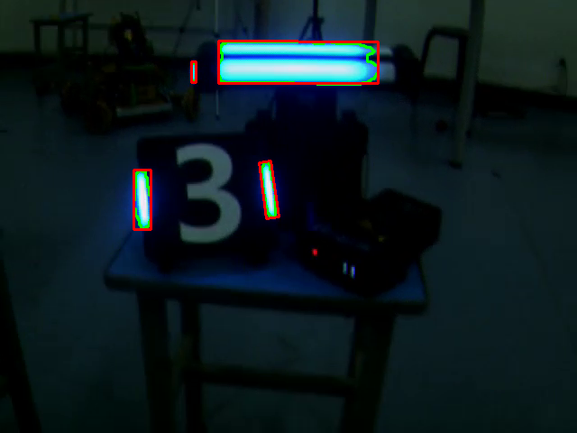

# Real-time Blue Light Bar Detection & Polygon Fitting

**Real-time Detection of Blue Arrow Light Bars Based on Geometric Processing**

## Project Overview

This module integrates outputs from the **HSV Calibration** and **Structured Single-frame Detection** modules to perform frame-by-frame boundary detection. Equipped with real-time visualization and optional video export, it enables high-precision tracking of blue arrow light bars within video streams.

**Pipeline Position:** HSV Calibration → Structured Color Detection → **Video/Temporal Processing (This Module)** → PnP Pose Estimation.

**Target Applications:** Real-time industrial monitoring, traffic signal detection, and embedded vision systems.

---

## 🎥 Detection Demonstration

> The following demonstration illustrates the real-time detection and bounding of blue arrow light bars within a video sequence.



---

## Methodology (Per-frame Processing)

### 1. Color Segmentation

Blue regions are isolated using the **HSV (Hue, Saturation, Value)** color space:

```python
cv2.inRange(hsv, lower_blue, upper_blue)

```

This method is robust against illumination changes. Thresholds can be tuned to adapt to various ambient lighting conditions.

### 2. Morphological Filtering

**Closing operations** are applied to eliminate small noise artifacts and smooth contour edges:

```python
cv2.morphologyEx(mask, cv2.MORPH_CLOSE, kernel, iterations=2)

```

### 3. Polygon Approximation

Even with complete contours, `cv2.approxPolyDP()` is utilized to simplify the geometry:

* **Noise Reduction:** Removes contour jitter and jagged edges.
* **Feature Extraction:** Identifies critical vertices for shape analysis.
* **Accuracy:** Enhances the precision of shape recognition and bounding box generation.

### 4. Minimum-Area Bounding

The system utilizes `cv2.minAreaRect` to generate **Rotated Bounding Boxes**, ensuring an accurate fit for targets that are tilted or rotated relative to the camera plane.

---

## Key Features

1. **Real-Time Performance**
* Extracts blue light bars via HSV segmentation.
* Retrieves contours with `cv2.findContours` and fits them with `cv2.minAreaRect`.
* **Visualization:** Contours are rendered in **Green**, while Rotated Rectangles are highlighted in **Red**.


2. **Advantages of Polygon Fitting**
* **Simplification:** Reduces vertex count while maintaining structural integrity.
* **Stability:** Improves the calculation of orientation and angles by eliminating high-frequency noise.
* **Efficiency:** Streamlines subsequent geometric analysis.


3. **User Interaction**
* **Spacebar:** Toggle Pause/Resume.
* **S Key:** Save current frame (automatically timestamped).
* **ESC Key:** Exit program.


4. **Automated Video Output**
* Processed frames are encoded into a video file in real-time.
* Filenames include timestamps to prevent data overwriting and allow for batch analysis.


---

## Workflow

1. **Preparation:** Place the video file in the script directory or connect a camera (Input index `"0"`).
2. **Execution:**
* Run the main script: `python main.py`
* Specify the source: `process_video("video.mp4")`


3. **Output:**
* **Timestamped Frames:** Static images captured during runtime.
* **Processed Video:** Final MP4 file containing the detection overlays.


---

## Optimization Summary

* **Adaptive Segmentation:** HSV thresholds can be adjusted via a GUI tool to handle fluctuating lighting.
* **Denoising:** Combined **Area Filtering** and **Morphological Closing** effectively filters out non-target artifacts.
* **Geometric Precision:** The use of **Minimum Area Rectangles** provides a tighter, more professional fit than standard Axis-Aligned Bounding Boxes (AABB).
* **Structural Integrity:** `approxPolyDP` ensures that the detected shape remains consistent across consecutive frames.

---

## Project Significance

This project demonstrates a comprehensive computer vision pipeline—from raw image acquisition and color-space transformation to geometric refinement and data logging. It serves as a robust foundation for **Intelligent Transportation Systems (ITS)**, **Industrial Quality Inspection**, and **Robotic Navigation**.


---

# 蓝色灯条检测与多边形拟合框选（视频实时处理）
基于几何处理的蓝色箭头灯条实时检测
## 项目简介

本模块基于HSV校准模块和单帧结构化检测模块的输出，实现基于多边形的边界的逐帧检测，并配备实时可视化和可选视频输出，实现了视频流中蓝色箭头灯条的实时检测与框选。

管道位置：HSV校准→结构化色彩检测→视频/时间处理（本模块）→pnp姿态估计

模块适用于 实时应用场景，如工业监控、交通信号检测及嵌入式视觉系统。

---
## 🎥 检测演示示例

> 下图为程序实时检测视频中蓝色箭头灯条的效果演示👇  


---

## 方法原理(对于每一帧)

### 1️. 颜色分割（Color Segmentation）
使用 HSV 色彩空间筛选蓝色区域：
```python
cv2.inRange(hsv, lower_blue, upper_blue)
```
该方法对亮度变化较为鲁棒，通过可调阈值适配不同环境光。

### 2️. 形态学操作（Morphological Filtering）
使用闭操作去除小噪声、平滑边缘：

```python
cv2.morphologyEx(mask, cv2.MORPH_CLOSE, kernel, iterations=2)
```
### 3️. 多边形拟合（Polygon Approximation）
即使已经能描出完整轮廓线，仍需 cv2.approxPolyDP() 进行简化：

去除轮廓抖动、噪声边；

提取关键角点；

提高形状识别与包围框精度。

### 3️. 最小面积边界 （Minimum-Area Bounding）
使用 cv2.minAreaRect 生成旋转矩形准确匹配倾斜或旋转的靶标

---

## 功能特点

1. **实时检测**  
   - 对视频或摄像头输入帧进行 HSV 颜色分割，提取蓝色箭头灯条。
   - 使用 `cv2.findContours` 获取轮廓，并用最小旋转矩形 `cv2.minAreaRect` 精确框选。
   - 可视化结果：绿色为轮廓线，红色为旋转矩形框。

2. **多边形拟合优势**  
   - 即使轮廓完整，使用多边形拟合 `approxPolyDP` 可：
     - 降噪简化轮廓，消除锯齿边缘。
     - 提取关键特征点，便于计算方向、角度。
     - 提高后续几何分析效率和框选稳定性。

3. **用户交互**  
   - **空格键**：暂停/继续播放视频。
   - **S 键**：保存当前帧图像，文件名自动添加时间戳。
   - **ESC 键**：退出程序。

4. **输出视频**  
   - 处理后的视频帧实时写入输出文件。
   - 输出文件名带时间戳，支持提前退出，保存已处理部分。
   - 方便批量分析和结果回顾。

5. **适用场景**  
   - 高速列车或车辆灯条检测、交通标识检测、工业流水线标志物监控等。

---

## 使用流程

1. 准备视频文件，放在脚本同目录下，或者使用摄像头（输入 `"0"`）。  

2. 运行程序：  
   - 在 Python 环境中运行主脚本：
     ```bash
     python main.py
     ```
   - 输入视频文件路径，例如：
     ```python
     process_video("video.mp4")
     ```
   程序将自动进行检测与可视化展示。  

   - 视频播放时实时检测蓝色箭头灯条。  
   - 可暂停查看检测效果（空格键暂停/继续）。  
   - 按 `S` 键保存当前帧（带时间戳，不退出）。  
   - 按 `ESC` 键退出程序。  

3. 处理完成后，程序会生成：  
   - 实时保存的帧图像（带时间戳）。  
   - 整个处理后的 MP4 视频文件（带时间戳）。  

---


## 优化点总结

1. **颜色分割优化**  
   - HSV 阈值可通过可视化工具调整，适应不同亮度和环境光条件。

2. **噪声过滤**  
   - 面积过滤 + 形态学闭操作，减少小杂点干扰。

3. **框选方式优化**  
   - 最小旋转矩形可准确匹配斜向目标，适合复杂场景。

4. **多边形拟合**  
   - approxPolyDP 简化轮廓，消除锯齿，提高方向和形状计算稳定性。

5. **结果可视化与保存**  
   - 保存帧和视频均带时间戳，方便批量处理和对比分析。
---

## 项目意义
本项目展示了图像处理与目标检测的综合应用流程，
展示了 从静态图像分析到实时视频检测再到可视化与存储的完整流程，
可应用于 交通信号识别、工业检测与智能监控 等领域研究与实践。
