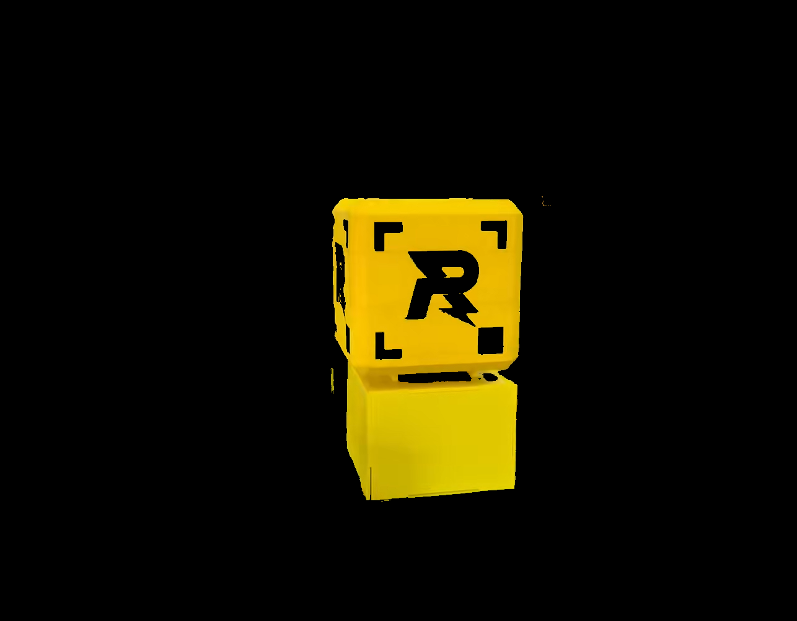
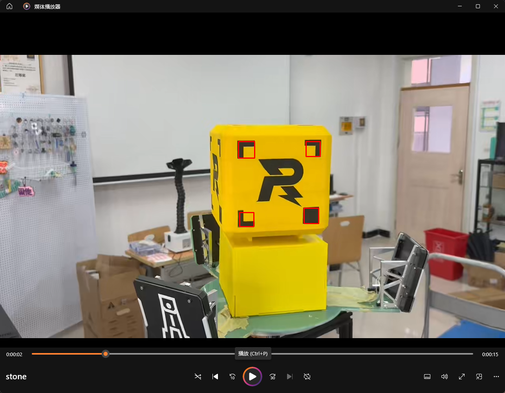

Here is the updated English version of your documentation. I have synchronized the structure, added the missing sections (Parameter Adjustment Guide, additional image/GIF placeholders), and aligned the technical descriptions with the Chinese version.

---

# 4_pose_estimation_pnp

## 🔹 Project Overview

This module implements a **structured object detection and 3D pose estimation pipeline** based on traditional computer vision. It supports multiple detection strategies and temporal smoothing for consecutive frames. The module is primarily applied to detecting marked ores, squares, or polygon targets and computing their 3D poses.

**Key features:**

* **Multi-strategy target detection:** Minimum bounding rectangle + area filtering, polygon combination recognition, and real-time ore detection.
* **Pose estimation:** Uses OpenCV `solvePnP` for 3D pose calculation, featuring temporal smoothing and outlier rejection (jitter filtering).
* **Visualization:** Supports 2D marking, 3D coordinate axis drawing, and reprojection point display.
* **Flexibility:** Adaptable to video or camera input, with support for result saving and frame capture.

---

## 📁 Directory Structure

```
4_pose_estimation_pnp/
├── detect_squares_area_filter/          
│   ├── imagepoints.py        # Helper functions: image corner extraction
│   ├── pnp.py                # Core pose estimation pipeline (solvePnP)
│   ├── pnp_math.py           # Mathematical utilities: reprojection, rotation matrix, smoothing
│   └── pnp_Matplotlib3D.py   # Camera trajectory visualization (Matplotlib)
└── other_vision/
    ├── detect_quad_from_hex_combo/      
    │   ├── test.py            # Polygon combination detection (1 square + 3 hex), with pose estimation
    │   └── test0.py           # Main demo: video processing + pose visualization
    └── gold_silver_detector.py # Real-time ore detection (detection only, no solvePnP)
assets/                          # Sample videos/images/resources
README.md
stone.mp4                        # Test video

```

 
> Note: The HSV segmentation range in this file is extracted via the `exact tool` function from 1.



---

## ⚙️ Function Overview

### 1️⃣ `detect_squares_area_filter/`

* Detect black square targets using minimum bounding rectangle + area similarity filtering.
* Used to verify if corner points can be accurately output.
* 
* Extract corner points for 3D pose estimation.
* Supports temporal smoothing to suppress jitter and abnormal jumps across consecutive frames.
* **GIF Demonstration:**
* 坐标绘制效果 

* ## ⚖️ Parameter Adjustment Guide

| Parameter | Meaning | Recommended Value | Notes |
| --- | --- | --- | --- |
| `jump_threshold` | Single-frame jump distance threshold | 40~60 | Unit: pixels; smaller values → stricter suppression |
| `area_diff_ratio` | Area difference ratio threshold | 0.3 | Discard squares if area fluctuation exceeds this ratio |
| `axis_length` | 3D axis length | 50 | Controls the length of the rendered 3D axes |

### 2️⃣ `other_vision/detect_quad_from_hex_combo/`

* Detect a combination of **1 square + 3 hexagons** on a yellow background and calculate the four-point rectangle.
* Select the best combination based on geometric scoring (rectangle approximation).
* Visualize centroids, corner numbering, and connecting lines.
* Supports `solvePnP` pose estimation and reprojection error handling.
* 


### 3️⃣ `other_vision/gold_silver_detector.py`

* Real-time detection of gold/silver ore markers (arrows + squares).
* Uses color segmentation, contour extraction, and shape recognition for marker identification.
* Highlights ROI for arrow and square markers.
* **Does not** include pose estimation; suitable for real-time monitoring or fast recognition.

---

## 📌 Technical Highlights

* **Multi-strategy Geometric Detection:** Combines minimum rectangle, area filtering, and polygon scoring for robust detection.
* **3D Pose Estimation:** Estimates 6DOF pose using OpenCV `solvePnP` (IPPE + ITERATIVE methods).
* **Temporal Smoothing:** Smooths rotation and translation vectors to reduce jitter.
* **Reprojection Validation:** Filters outliers based on reprojection error to ensure pose reliability.
* **Modular Design:** Different strategies can be invoked independently, facilitating rapid experimentation and iteration.

---

## 💻 Dependencies

* Python ≥ 3.6
* OpenCV (`cv2`)
* NumPy (`np`)
* Matplotlib (strictly for 3D visualization in `pnp_Matplotlib3D.py`)

Install dependencies:

```bash
pip install opencv-python numpy matplotlib

```

---

## 🚀 Usage Examples

### 1. Polygon combination pose detection (video)

```bash
cd other_vision/detect_quad_from_hex_combo/
python test0.py

```

* **Spacebar:** Pause/Resume playback
* **S:** Save current frame
* **ESC:** Exit

### 2. Real-time ore detection

```bash
cd other_vision/
python gold_silver_detector.py

```

* Enter `a` to detect gold, `b` to detect silver.
* Supports real-time camera detection of markers.

### 3. Custom Video/Frame Processing

* Modify the `stone.mp4` path as needed.
* Outputs `first_frame_detected.png` (saved upon the first detection of four corners).
* Processed videos are saved in the `results/` folder.

---

## 🖼️ Visualization

1. Detect rectangles and polygon corners, labeled in clockwise order.
2. Draw 3D coordinate axes and reprojection points.
3. Highlight ROI for arrows and square markers.
4. Real-time ore detection status output (Gold/Silver).

---

## 📈 Project Advantages

* **Engineering-Ready:** Directly applicable to industrial vision inspection or robotic calibration.
* **Extensible:** Supports diverse target shapes, color backgrounds, and various video sources.
* **Professional Workflow:** Demonstrates a full **traditional vision + pose estimation + temporal smoothing** pipeline.

---

# 4_pose_estimation_pnp

## 🔹 项目概述

本模块实现了基于传统计算机视觉的 **结构化目标检测与三维位姿估计流水线**，支持多种目标检测策略和连续帧平滑处理。主要应用于带有标记的矿石、方形或多边形目标的检测与三维姿态计算。

模块特点：

* 多策略目标检测：最小矩形 + 面积过滤、多边形组合识别、实时矿石识别。
* 位姿估算：使用 OpenCV `solvePnP` 进行三维姿态求解，支持连续帧平滑与异常跳动过滤。
* 可视化输出：支持 2D 标记、3D 坐标轴绘制、重投影点显示。
* 灵活性：适配视频或摄像头输入，支持结果保存与帧截图。

---

## 📁 目录结构

```
4_pose_estimation_pnp/
├── detect_squares_area_filter/          
│   ├── imagepoints.py        # 辅助函数：图像角点提取
│   ├── pnp.py                # 位姿解算核心流程（solvePnP）
│   ├── pnp_math.py           # 数学计算验证误差：重投影、旋转矩阵、平滑滤波
│   └── pnp_Matplotlib3D.py   # 相机轨迹可视化（Matplotlib）
└── other_vision/
    ├── detect_quad_from_hex_combo/      
    │   ├── test.py            # 多边形组合检测（1 square + 3 hex），带位姿解算
    │   └── test0.py           # 主程序，演示视频处理 + 位姿可视化
    └── gold_silver_detector.py # 实时矿石检测（仅检测，无 solvePnP）
assets/                          # 示例视频/图片/资源
README.md
stone.mp4                        # 测试视频
```

 
> 注意此文件中的HSV分割范围由T1中的exact tool函数提取

---

## ⚙️ 功能概览

### 1️⃣ `detect_squares_area_filter/`

* 使用最小外接矩形 + 面积相似度过滤检测黑色方形目标。
* * 框选目标，可用于检测角点是否可以准确输出 
* 
* 提取角点用于三维位姿计算。
* 支持连续帧位姿平滑，抑制异常跳动。 
* GIF 演示 
* 坐标绘制效果 
* ## ⚖️ Parameter Adjustment Guide

| Parameter | Meaning | Recommended Value | Notes |
|:--|:--|:--|:--|
| `jump_threshold` | Single-frame jump distance threshold | 40~60 | Unit: pixels; smaller values → stricter suppression |
| `area_diff_ratio` | Area difference ratio threshold | 0.3 | Discard squares if area fluctuation exceeds this ratio |
| `axis_length` | 3D axis length | 50 | Controls the length of drawn axes |


### 2️⃣ `other_vision/detect_quad_from_hex_combo/`

* 在黄色背景中检测 1 个方形 + 3 个六边形的组合，计算四点矩形。
* 根据几何评分（矩形近似度）选择最佳组合。
* 可视化质心、角点编号及连线。
* 支持 solvePnP 位姿解算及重投影异常处理。
* 

### 3️⃣ `other_vision/gold_silver_detector.py`

* 实时检测金矿石/银矿石标记（箭头 + 方块）。
* 基于颜色分割、轮廓提取、形状判别完成标记识别。
* ROI 高亮显示箭头与方块标记。
* 不含位姿计算，适合实时监控或快速识别。

---

## 📌 技术亮点

* **多策略几何检测**：结合最小矩形、面积过滤、多边形组合评分，实现稳定检测。
* **三维位姿求解**：使用 OpenCV `solvePnP`（IPPE + ITERATIVE）方法估计 6DOF 姿态。
* **连续帧平滑**：平滑旋转向量和位移向量，减少抖动。
* **重投影校验**：通过重投影误差过滤异常解，保证位姿可靠性。
* **模块化设计**：不同策略可独立调用，适合快速实验和迭代开发。

---

## 💻 依赖环境

* Python ≥ 3.6
* OpenCV (`cv2`)
* NumPy (`np`)
* Matplotlib（仅用于 3D 可视化 `pnp_Matplotlib3D.py`）

安装依赖示例：

```bash
pip install opencv-python numpy matplotlib
```

---

## 🚀 使用示例

### 1. 多边形组合位姿检测（视频）

```bash
cd other_vision/detect_quad_from_hex_combo/
python test0.py
```

* 空格键暂停/继续播放
* `S` 保存当前帧
* `ESC` 退出

### 2. 实时矿石检测

```bash
cd other_vision/
python gold_silver_detector.py
```

* 输入 `a` 检测金矿石，输入 `b` 检测银矿石
* 可通过摄像头实时检测标记

### 3. 自定义视频或帧处理

* 修改 `stone.mp4` 路径即可
* 输出first_frame_detected.png（首次检测到四个角点时保存）
* 输出视频会保存在 `results/` 文件夹

---

## 🖼️ 可视化效果

1. 检测矩形和多边形角点，并按顺时针编号
2. 绘制 3D 坐标轴与重投影点
3. ROI 高亮显示箭头与方块标记
4. 支持实时矿石识别状态输出（Gold/Silver）

---

## 📈 项目优势

* **工程化可用**：可用于工业视觉检测或机器人标定。
* **可扩展**：支持不同目标形状、颜色背景、视频来源。
